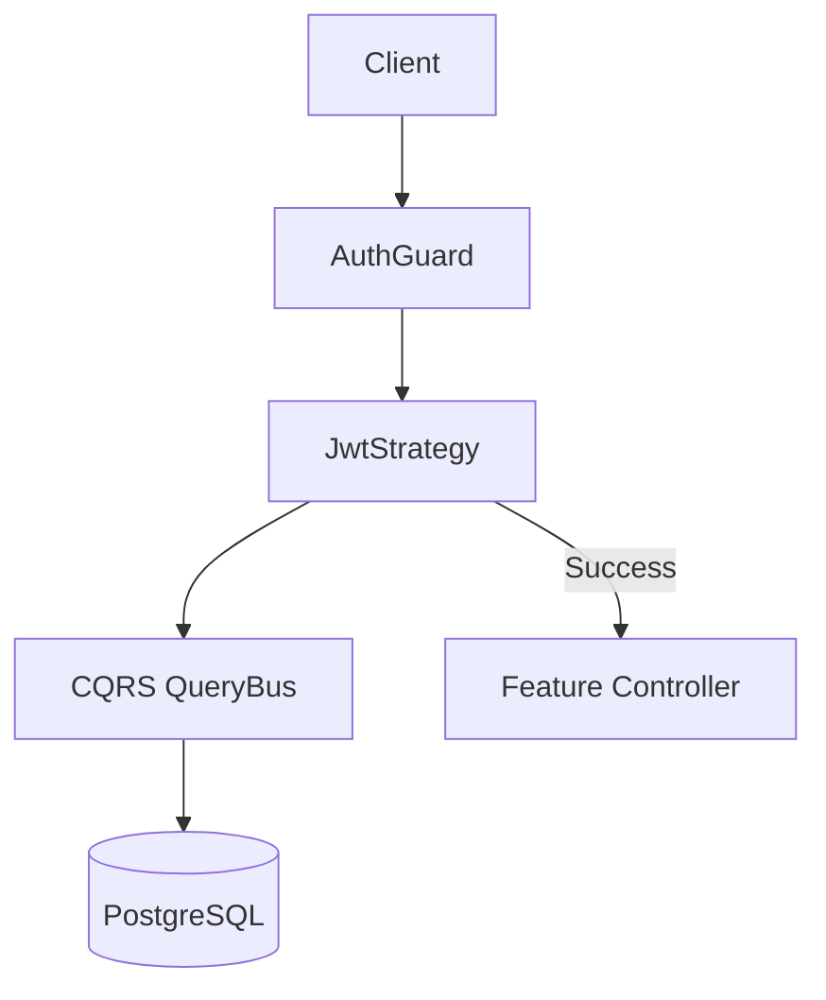

# System Architecture

## Overview
The system follows a Hexagonal/Clean Architecture approach adapted for NestJS using the CQRS pattern.

## Authentication Flow
1. **Login**: User provides email/password → `AuthService` validates → Generates JWT.
2. **Request**: Client sends JWT in `Authorization` header.
3. **Validation**: `JwtStrategy` intercepts:
   - Verifies signature.
   - Extracts payload.
   - **DB Check**: Queries user from database to ensure account is active and not deleted.
   - Attaches user to `Request`.

## Module Interaction

## Security Design
- **Secrets**: Managed via `ConfigService` and environment variables.
- **Payload**: JWT contains minimal data (`id`, `email`). Roles are hydrated during validation.
- **Password Hashing**: Done before storage (Argon2 or similar via shared utils).

## Database Seeding
The seeding infrastructure provides a way to populate the database with initial or mock data.
- **BaseSeeder**: Abstract class providing access to `DataSource`.
- **SeedRunner**: CLI utility that discovery and executes seeders.
- **Production Guard**: Prevents accidental data seeding in production.
