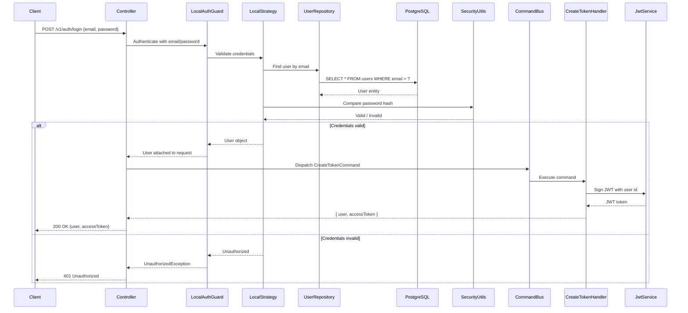
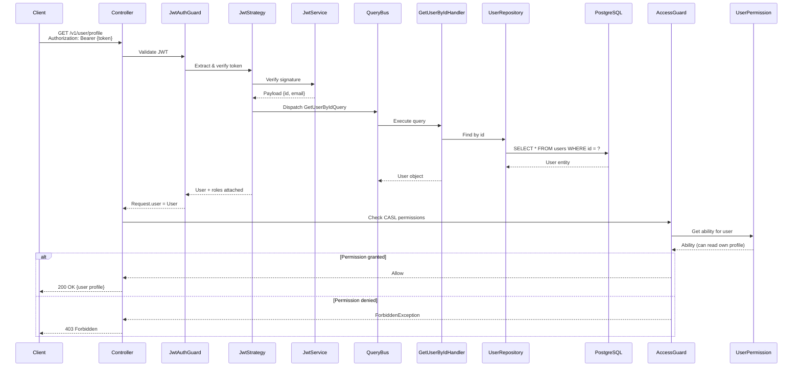
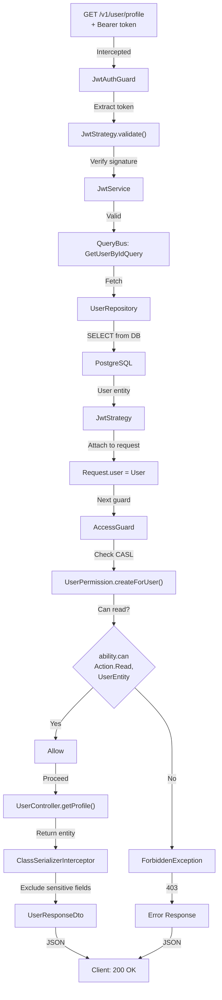

# System Architecture

## Overview

**nest-boilerplate** follows **Hexagonal (Ports & Adapters) + Clean Architecture** principles adapted for NestJS. Core domain logic is isolated from framework details via CQRS, Guards, and Repository patterns.

### Architectural Layers

```
┌─────────────────────────────────────────────────┐
│  HTTP / REST API (Fastify)                      │  External Interface
├─────────────────────────────────────────────────┤
│  Controllers (endpoint handlers)                │  Adapter Layer
├─────────────────────────────────────────────────┤
│  Guards (authentication, authorization)         │  Security Layer
├─────────────────────────────────────────────────┤
│  CQRS: CommandBus / QueryBus                    │  Application Layer
│  Commands (state changes) / Queries (reads)     │
├─────────────────────────────────────────────────┤
│  Repositories, Services (domain logic)          │  Domain Layer
├─────────────────────────────────────────────────┤
│  Entities, Value Objects                        │  Domain Models
├─────────────────────────────────────────────────┤
│  TypeORM (data mapper), PostgreSQL              │  Persistence Layer
└─────────────────────────────────────────────────┘
```

---

## Authentication & Authorization Flow

### 1. Login Flow


```mermaid
sequenceDiagram
    Client->>Controller: POST /v1/auth/login {email, password}
    Controller->>LocalAuthGuard: Authenticate with email/password
    LocalAuthGuard->>LocalStrategy: Validate credentials
    LocalStrategy->>UserRepository: Find user by email
    UserRepository->>PostgreSQL: SELECT * FROM users WHERE email = ?
    PostgreSQL-->>UserRepository: User entity
    LocalStrategy->>SecurityUtils: Compare password hash
    SecurityUtils-->>LocalStrategy: Valid / Invalid
    alt Credentials valid
        LocalStrategy-->>LocalAuthGuard: User object
        LocalAuthGuard-->>Controller: User attached to request
        Controller->>CommandBus: Dispatch CreateTokenCommand
        CommandBus->>CreateTokenHandler: Execute command
        CreateTokenHandler->>JwtService: Sign JWT with user id
        JwtService-->>CreateTokenHandler: JWT token
        CreateTokenHandler-->>Controller: { user, accessToken }
        Controller-->>Client: 200 OK {user, accessToken}
    else Credentials invalid
        LocalStrategy-->>LocalAuthGuard: Unauthorized
        LocalAuthGuard-->>Controller: UnauthorizedException
        Controller-->>Client: 401 Unauthorized
    end
```

### 2. Protected Request Flow


```mermaid
sequenceDiagram
    Client->>Controller: GET /v1/user/profile<br/>Authorization: Bearer {token}
    Controller->>JwtAuthGuard: Validate JWT
    JwtAuthGuard->>JwtStrategy: Extract & verify token
    JwtStrategy->>JwtService: Verify signature
    JwtService-->>JwtStrategy: Payload {id, email}
    JwtStrategy->>QueryBus: Dispatch GetUserByIdQuery
    QueryBus->>GetUserByIdHandler: Execute query
    GetUserByIdHandler->>UserRepository: Find by id
    UserRepository->>PostgreSQL: SELECT * FROM users WHERE id = ?
    PostgreSQL-->>UserRepository: User entity
    GetUserByIdHandler-->>QueryBus: User object
    JwtStrategy-->>JwtAuthGuard: User + roles attached
    JwtAuthGuard-->>Controller: Request.user = User
    Controller->>AccessGuard: Check CASL permissions
    AccessGuard->>UserPermission: Get ability for user
    UserPermission-->>AccessGuard: Ability (can read own profile)
    alt Permission granted
        AccessGuard-->>Controller: Allow
        Controller-->>Client: 200 OK {user profile}
    else Permission denied
        AccessGuard-->>Controller: ForbiddenException
        Controller-->>Client: 403 Forbidden
    end
```

### 3. Token Invalidation (Session Integrity)

When a user is deleted, existing JWT tokens are invalidated:

```
1. Admin calls: DELETE /v1/user/:id
2. UpdateUserCommand → UpdateUserHandler deletes user
3. User removed from PostgreSQL
4. Client sends old JWT in next request
5. JwtStrategy executes GetUserByIdQuery
6. Repository returns null (user no longer exists)
7. JwtStrategy throws UnauthorizedException
8. Request rejected, client must re-authenticate
```

**Result:** No "zombie" sessions from leaked tokens.

---

## CQRS Pattern Architecture

### Command-Driven State Changes

```
User Action (e.g., register)
    ↓
Controller receives DTO
    ↓
Validation Pipe (class-validator)
    ↓
CommandBus.execute(Command)
    ↓
CommandHandler executes
    ↓
Repository.save() → PostgreSQL
    ↓
Response DTO → JSON → Client
```

**Key principles:**
- One command per state-changing action
- Handlers encapsulate business logic
- Repositories abstract database details
- DTOs validate input fail-fast

### Query-Driven Reads

```
User Action (e.g., get profile)
    ↓
Controller
    ↓
QueryBus.execute(Query)
    ↓
QueryHandler executes
    ↓
Repository.findOne() → PostgreSQL
    ↓
Response DTO → JSON → Client
```

**Key principles:**
- Queries never mutate state
- Fast path: minimal business logic
- Can be cached for performance

### Handler Example

```typescript
@CommandHandler(UpdateUserCommand)
export class UpdateUserHandler implements ICommandHandler<UpdateUserCommand> {
  constructor(
    private readonly userRepository: UserRepository,
    private readonly securityUtils: SecurityUtils,
  ) {}

  async execute(command: UpdateUserCommand) {
    const user = await this.userRepository.findOne(command.userId)

    if (!user) {
      throw new NotFoundException()
    }

    // Hash password if changed
    if (command.payload.password) {
      command.payload.password = await this.securityUtils.hashPassword(
        command.payload.password,
      )
    }

    // Apply updates
    Object.assign(user, command.payload)

    // Persist
    return this.userRepository.save(user)
  }
}
```

---

## Module Architecture

### Module Dependency Graph

```
AppModule (root)
    ├── ConfigModule (global)
    ├── TypeOrmModule (async, transactional)
    ├── CaslModule (authorization)
    ├── AuthModule
    │   ├── JwtModule
    │   ├── PassportModule
    │   ├── AuthController
    │   ├── JwtStrategy
    │   ├── LocalStrategy
    │   └── CQRS Handlers
    └── UserModule
        ├── UserController
        ├── UserAdminController
        ├── UserRepository
        ├── UserPermission
        ├── CQRS Handlers
        └── CASL Hook
```

### AuthModule

**Responsibilities:**
- User registration with email/password
- User login with JWT token generation
- JWT token signing & validation
- Strategy implementations (Passport)

**Exports:**
- JwtStrategy (used globally)
- LocalStrategy (used for /login endpoint)

**Key files:**
- `local.strategy.ts`: Email + password validation
- `jwt.strategy.ts`: Token verification + DB user check
- `auth.controller.ts`: /register, /login endpoints
- Command handlers: RegisterByEmail, LoginByEmail, CreateToken

### UserModule

**Responsibilities:**
- User profile management (CRUD)
- Role-based access control (CASL)
- User data queries

**Exports:**
- UserRepository (for other modules)
- UserPermission (for access guards)

**Key files:**
- `user.controller.ts`: /profile endpoints (user-only)
- `user-admin.controller.ts`: /user/:id endpoints (admin-only)
- `user.permission.ts`: CASL rules
- `user.hook.ts`: Dynamic permission context
- Query handlers: GetUserById, GetUserByEmail
- Command handler: UpdateUser

---

## Data Flow Diagrams

### Entity Lifecycle (Create)


```mermaid
graph LR
    A["RegisterByEmailDto<br/>(input)"] -->|Validated| B["RegisterByEmailCommand"]
    B -->|Dispatched| C["RegisterByEmailHandler"]
    C -->|Create| D["UserEntity<br/>(not yet saved)"]
    D -->|Hashed password| E["SecurityUtils"]
    E -->|Set password| D
    D -->|Saved| F["UserRepository.save()"]
    F -->|INSERT| G["PostgreSQL"]
    G -->|Entity with id| H["CreateTokenCommand"]
    H -->|Dispatched| I["CreateTokenHandler"]
    I -->|Sign JWT| J["JwtService"]
    J -->|Token string| K["LoginResponseDto"]
    K -->|Serialized| L["JSON Response"]
    L -->|200 OK| M["Client"]
```

### Guard Chain on Protected Endpoint


```mermaid
graph TD
    A["GET /v1/user/profile<br/>+ Bearer token"] -->|Intercepted| B["JwtAuthGuard"]
    B -->|Extract token| C["JwtStrategy.validate()"]
    C -->|Verify signature| D["JwtService"]
    D -->|Valid| E["QueryBus: GetUserByIdQuery"]
    E -->|Fetch| F["UserRepository"]
    F -->|SELECT from DB| G["PostgreSQL"]
    G -->|User entity| H["JwtStrategy"]
    H -->|Attach to request| I["Request.user = User"]
    I -->|Next guard| J["AccessGuard"]
    J -->|Check CASL| K["UserPermission.createForUser()"]
    K -->|Can read?| L{ability.can<br/>Action.Read,<br/>UserEntity}
    L -->|Yes| M["Allow"]
    L -->|No| N["ForbiddenException"]
    M -->|Proceed| O["UserController.getProfile()"]
    N -->|403| P["Error Response"]
    O -->|Return entity| Q["ClassSerializerInterceptor"]
    Q -->|Exclude sensitive fields| R["UserResponseDto"]
    R -->|JSON| S["Client: 200 OK"]
    P -->|JSON| S
```

---

## Security Architecture

### Password Security

1. **Input:** Plain password in DTO
2. **Validation:** class-validator (length, complexity) at entry
3. **Hashing:** SecurityUtils.hashPassword(argon2 or bcrypt) before storage
4. **Storage:** Hashed only, never plaintext
5. **Comparison:** SecurityUtils.validatePassword() on login

### Token Security

1. **Generation:** JwtService.sign() with secret from ConfigService
2. **Storage:** Client-side (browser local storage or session storage)
3. **Transmission:** Authorization: Bearer {token} header
4. **Validation:** 
   - Signature verification (prevents tampering)
   - DB user check (prevents stale sessions)
   - Expiration check (prevents replay attacks)

### CORS & Helmet

- **CORS:** Explicit origin whitelist (prevent CSRF)
- **Helmet:** CSP, X-Frame-Options, X-Content-Type-Options (prevent injection)
- **HTTPS:** Recommended in production (force via reverse proxy)

---

## Database Architecture

### Entity-Relationship Diagram

```
┌─────────────────┐
│    UserEntity   │
├─────────────────┤
│ id (PK)         │
│ email (unique)  │
│ password        │
│ name            │
│ role (enum)     │
│ createdAt       │
│ updatedAt       │
└─────────────────┘
```

### Naming Strategy

- **Database columns:** `snake_case` (SnakeNamingStrategy)
- **TypeScript properties:** `camelCase`
- **Example:** `@Column() createdAt` → `created_at` in PostgreSQL

### Query Examples

```typescript
// Via repository
const user = await userRepository.findByEmail('test@example.com')

// Raw query (avoid unless necessary)
const user = await userRepository.createQueryBuilder('u')
  .where('u.email = :email', { email: 'test@example.com' })
  .getOne()
```

---

## Transactional Data Consistency

Uses `typeorm-transactional` decorator:

```typescript
@Transactional()
async updateUser(userId: number, payload: UpdateUserDto) {
  // All DB operations atomic
  await userRepository.update(userId, payload)
  await emailService.send() // If fails, rollback updateUser too
  // Auto-commit on success, auto-rollback on error
}
```

---

## Configuration Injection

### Pattern: registerAs + ConfigService

```typescript
// 1. Define config interface
export interface AppConfiguration {
  host: string
  port: number
}

// 2. Register with registerAs
export const appConfiguration = registerAs('app', (): AppConfiguration => ({
  host: process.env.SERVICE_HOST || '0.0.0.0',
  port: parseInt(process.env.SERVICE_PORT || '3000'),
}))

// 3. Inject in module
@Module({
  imports: [
    ConfigModule.forRoot({
      load: [appConfiguration],
      isGlobal: true,
    }),
  ],
})
export class AppModule {}

// 4. Use in services
constructor(private configService: ConfigService) {
  const appConfig = this.configService.get<AppConfiguration>('app')
}
```

---

## Scalability Considerations

### Current Design (Phase 1)

- **Single instance:** No horizontal scaling yet
- **Database:** Direct connection (no pooling abstractions)
- **Caching:** None (every request hits DB)
- **Queues:** None (all operations synchronous)

### Future Enhancements (Phase 2+)

- **Multi-instance:** Load balancer + sticky sessions
- **Database pooling:** PgBouncer or TypeORM connection pool tuning
- **Redis cache:** User profile, permissions caching
- **Message queue:** Async tasks (emails, webhooks)
- **Read replicas:** Separate read/write connections
- **CDN:** Static assets, API response caching

---

## Error Handling & Logging

### Exception Strategy

```
Input Error (DTO validation)
    ↓ (caught by ValidationPipe)
    ↓ BadRequestException (400)

Resource Not Found
    ↓ (thrown in handler)
    ↓ NotFoundException (404)

Authorization Failure
    ↓ ForbiddenException (403)

Authentication Failure
    ↓ UnauthorizedException (401)

Server Error (unexpected)
    ↓ InternalServerErrorException (500)
```

### Logging

- **Morgan (HTTP):** Dev mode request logging
- **Logger (app):** NestJS logger for startup, errors
- **App logs:** Store in stdout (collected by orchestration tool)

---

## Deployment Architecture

### Docker Container

```
Dockerfile (multi-stage):
├── Stage 1 (builder): Node + pnpm, install deps, compile TS
├── Stage 2 (runner): Slim Node, copy compiled JS, expose 3000
└── ENTRYPOINT: node dist/main.js
```

### Docker Compose (Local)

```yaml
services:
  app:
    image: nest-boilerplate:latest
    ports: [3000:3000]
    environment: [.env file]
    depends_on: [postgres]

  postgres:
    image: postgres:14
    ports: [5434:5432]
    environment: [DB_USER, DB_PASSWORD, etc.]
    volumes: [postgres_data]
```

### CI/CD Pipeline (GitHub Actions)

```
PR/Push Event
    ↓
Lint & Format Check (ESLint, Prettier)
    ↓
Unit & E2E Tests (Jest)
    ↓
Build Docker Image
    ↓
Push to Registry
    ↓
Semantic Release (version bump, tag, release notes)
    ↓
Deploy (if configured)
```
